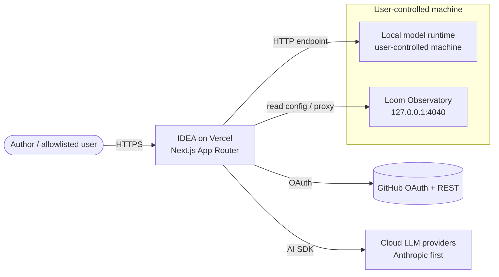

# IDEA — Architecture Specification

## 1. System context



IDEA is the **control plane**: it authenticates, holds configuration and registries,
talks to cloud providers directly, and **delegates anything local** (local models,
project dashboards) to processes on the user's own machine reached over HTTP.

## 2. Runtime & stack

- **Framework:** Next.js `16.2.11` (App Router) + React `19.2.4`, Tailwind 4.
- **Auth:** `next-auth@^5.0.0-beta.32` (Auth.js) — GitHub provider, JWT session.
- **Model layer:** `ai@^7.0.37` + `@ai-sdk/anthropic@^4.0.20` + `@ai-sdk/react@^4.0.40`.
- **GitHub:** `@octokit/rest@^22.0.1`.
- **Validation/contracts:** `zod@^4.4.3` (see `05-data-contracts.md`).
- **Host:** Vercel (serverless functions; `runtime = "nodejs"` on API routes).

## 3. Layered design

```
┌──────────────────────────────────────────────────────────────┐
│ UI (app/, components/)                                        │
│   chat-workspace · model picker · project pane · repo browser│
├──────────────────────────────────────────────────────────────┤
│ API routes (app/api/*)                                       │
│   auth · repos{,/tree,/file} · chat · route(Phase2) ·        │
│   models · skills · projects                                 │
├──────────────────────────────────────────────────────────────┤
│ Core libs (lib/)  — deterministic, unit-tested               │
│   github · router · cost · registry · manifest · fit         │
├──────────────────────────────────────────────────────────────┤
│ Providers (adapters)                                         │
│   cloud (AI SDK) · local endpoint (OpenAI-compatible)        │
├──────────────────────────────────────────────────────────────┤
│ Projects  — local processes IDEA controls/proxies            │
│   loom (Observatory :4040) · <future projects>               │
└──────────────────────────────────────────────────────────────┘
```

**Rule:** business logic that can be deterministic lives in `lib/` as pure functions
with tests. API routes are thin: authenticate → validate (Zod) → call lib → stream/return.

## 4. Phase plan

### Phase 1 — shipped (`7e48ed3`)
Auth (GitHub + allowlist), repo-pull (`/api/repos`, `/tree`, `/file`), streaming
chat (`/api/chat`), chat workspace UI. **Do not rebuild.**

### Phase 2 — this package
1. **Model registry + manual picker** — `lib/registry.ts`, `GET /api/models`, UI selector.
2. **Deterministic router** — `lib/router.ts` (`scoreComplexity`, `selectModel`),
   `lib/cost.ts` (weighted cost), wired into `/api/chat` when mode = `auto`.
3. **Provider adapters** — cloud (existing) + `lib/providers/local.ts` (OpenAI-compatible).
4. **Portable skills/agents** — `lib/manifest.ts` (parse `SKILL.md`), agent loop over
   AI SDK tool-calling, `GET /api/skills`, tool allowlist.
5. **Local models control plane** — `POST /api/local/*` proxied to the user's local
   helper; `lib/fit.ts` (size↔memory classifier); HF search/install (client/helper-side).
6. **Projects + Loom** — `lib/projects.ts` registry, start/stop + proxy, read Loom
   `config.yaml` for cost seeding. See `06-loom-integration.md`.

### Phase 3 — later (not scoped here)
Chat persistence, richer skill marketplace, multi-project orchestration, budget
analytics dashboards inside IDEA.

## 5. Key design decisions (ADR-style, condensed)

- **AD-1 Serverless control plane, local data plane.** Vercel can't run local models
  or read the user's disk. Everything local is a separate process IDEA talks to over
  HTTP. *Consequence:* FR-6/FR-7 need a small local helper (or browser→localhost).
- **AD-2 Provider-agnostic via AI SDK.** All model calls go through `ai`'s uniform
  interface so routing and skills work across vendors unchanged.
- **AD-3 Deterministic router.** Complexity scoring is rule-based and inspectable; no
  hidden ML. Cost weights are explicit registry data. *Consequence:* predictable,
  testable, explainable routing.
- **AD-4 Registries as data contracts.** Models, skills, and projects are declarative
  Zod-validated records (`05-data-contracts.md`), not code — easy to edit and audit.
- **AD-5 Loom as project #1, not a fork.** IDEA vendors Loom under `projects/`
  (git-ignored) and integrates by process control + HTTP proxy + config read — Loom
  stays an independent repo.

## 6. Security model

- Auth allowlist fail-closed (Phase 1).
- Every API route re-checks `auth()`; no route trusts the client.
- Tool allowlist for skills/agents; no arbitrary code execution.
- Provider keys and local-endpoint URLs in env/secret store only.
- Local helper endpoints bound to `127.0.0.1`; IDEA proxies with a per-session token
  (mirror Loom/ripple's `127.0.0.1 + Host allowlist + token` pattern).
- Per-session budget cap enforced in the router before any spend.
