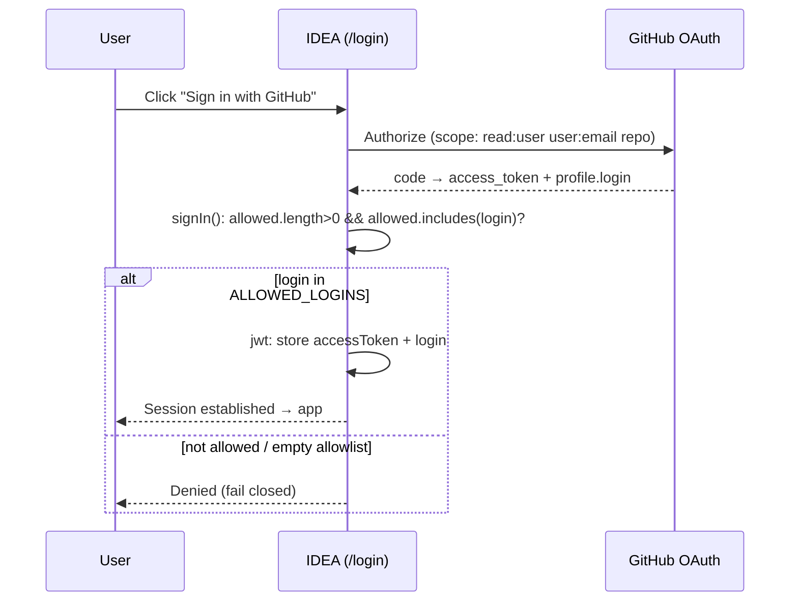
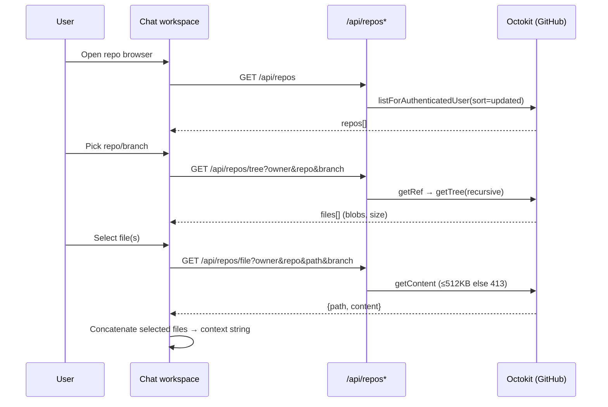
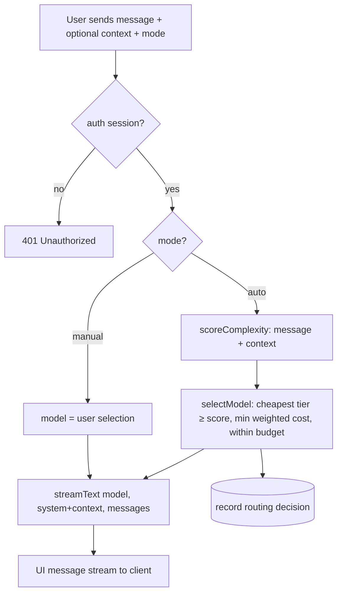
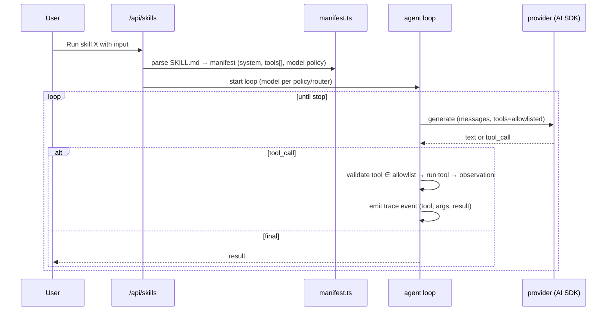
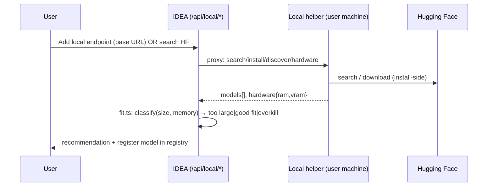
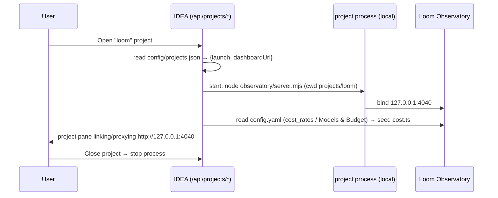

# IDEA — Process Maps & Flows

## PF-1 Authentication (Phase 1 — shipped)



## PF-2 Repo pull → context (Phase 1 — shipped)



## PF-3 Chat turn (Phase 1 shipped; Phase 2 adds routing)



## PF-4 Automatic model routing (Phase 2, deterministic)

```mermaid
flowchart LR
  In[prompt + context] --> S1[signals:<br/>token length, code fences,<br/>#files, imperative verbs,<br/>reasoning keywords, tool need]
  S1 --> Sc[score = weighted sum → tier: light | standard | heavy]
  Sc --> Cand[candidate models where model.tier >= required tier]
  Cand --> Cost[rank by cost_weight * est_tokens]
  Cost --> Cap{within session budget?}
  Cap -- yes --> Pick[pick cheapest]
  Cap -- no --> Deg[degrade to cheapest capable + warn]
  Pick --> Dec[emit RoutingDecision]
  Deg --> Dec
```
*All steps are pure functions (`lib/router.ts`, `lib/cost.ts`) — unit-tested, no model call.*

## PF-5 Skill / agent execution (Phase 2)



## PF-6 Local model registration & fit (Phase 2)


*IDEA on Vercel only proxies + classifies; the helper does all local/HF work (E-6.a/E-6.b).*

## PF-7 Project registration — Loom Observatory (Phase 2)


